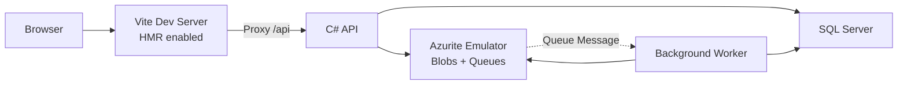
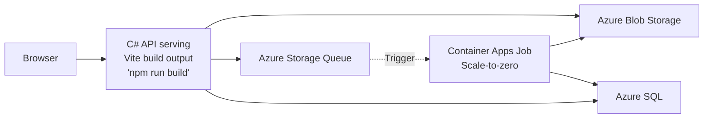

# Image Gallery with Azure Container Apps Jobs

Upload images to Azure Blob Storage with queue-triggered thumbnail generation. Background worker processes thumbnails using Container Apps Jobs.

## Architecture

**Run Mode:**


**Publish Mode:**


## What This Demonstrates

- **AddAzureStorage**: Blob storage and queues with automatic `.RunAsEmulator()` for local development
- **AddAzureSqlServer**: SQL Server container in run mode, Azure SQL in publish mode with `.RunAsContainer()`
- **PublishAsAzureContainerApp**: API scales to zero when idle, reducing costs
- **PublishAsScheduledAzureContainerAppJob**: Worker runs on schedule to process queue messages
- **PublishWithContainerFiles**: Vite frontend embedded in API container
- **WaitFor**: Ensures dependencies start in correct order
- **OpenTelemetry**: Distributed tracing across upload → queue → worker pipeline

## Running

```bash
aspire run
```

## Commands

```bash
aspire run      # Run locally with Azurite
aspire deploy   # Deploy to Docker Compose
aspire do docker-compose-down-dc  # Teardown deployment
```

## Key Aspire Patterns

**Azure Storage Emulation** - Automatic Azurite in run mode, real Azure in publish:
```csharp
var storage = builder.AddAzureStorage("storage").RunAsEmulator();
var blobs = storage.AddBlobContainer("images");
var queues = storage.AddQueues("queues");
```

**Azure SQL Dual Mode** - SQL Server container locally, Azure SQL in production:
```csharp
var sql = builder.AddAzureSqlServer("sql")
    .RunAsContainer()
    .AddDatabase("imagedb");
```

**Scale to Zero** - API only runs when handling requests:
```csharp
api.PublishAsAzureContainerApp((infra, app) =>
{
    app.Template.Scale.MinReplicas = 0;
});
```

**Scheduled Container App Job** - Worker runs every 5 seconds:
```csharp
worker.PublishAsScheduledAzureContainerAppJob("*/5 * * * * *");
```

**Container Files Publishing** - Embed Vite build output in API container:
```csharp
api.PublishWithContainerFiles(frontend, "wwwroot");
```
